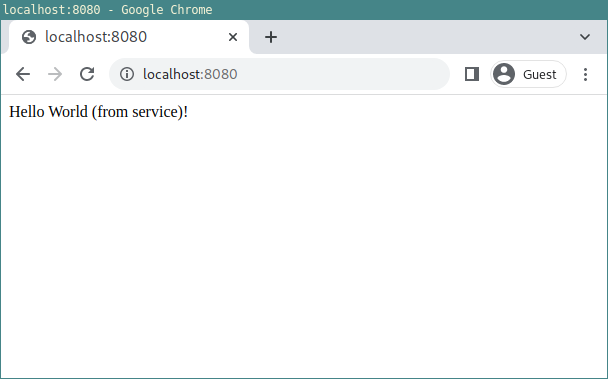
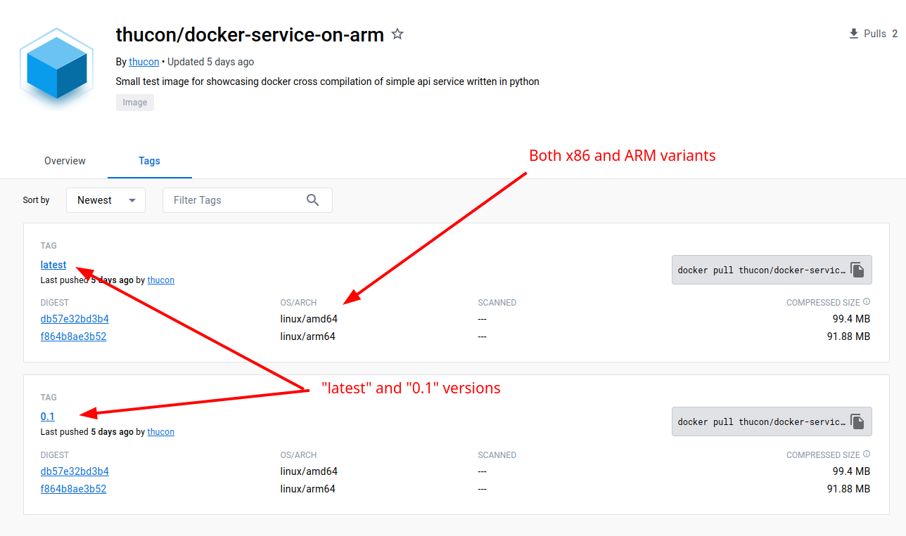
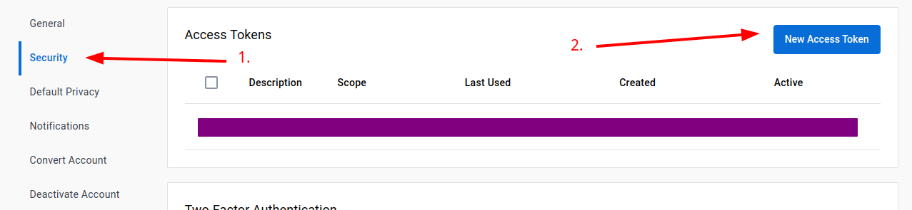
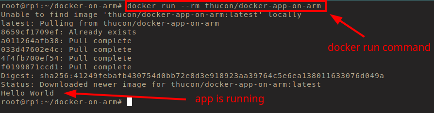
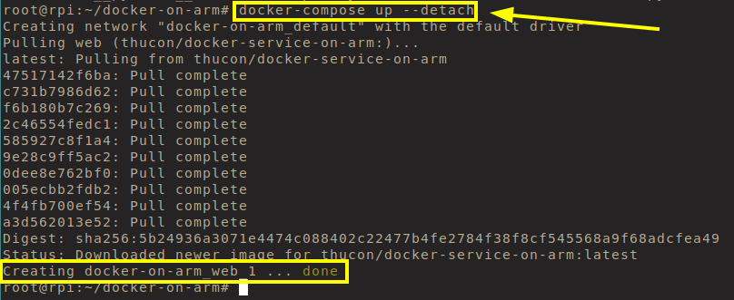
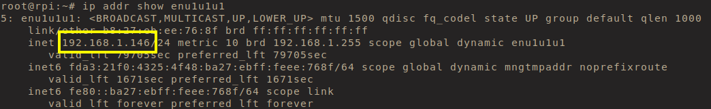
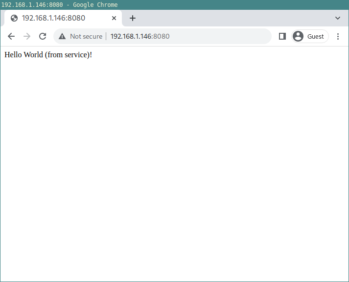
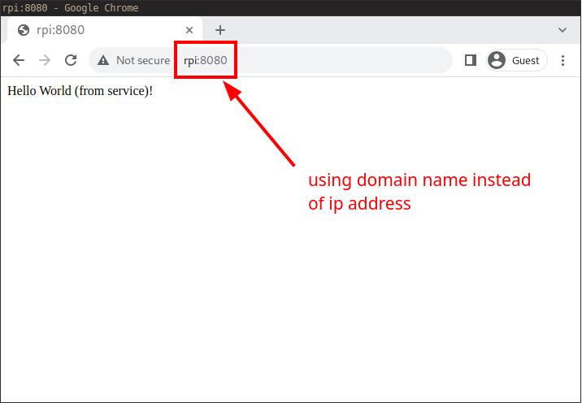

# docker-on-arm

This project shows how to cross compile docker applications and services to 
`arm` targets.

The main goal is to be able to run the docker containers on a Raspberry Pi 3
with a custom Yocto embedded Linux.

To see how the Yocto image was made please refer to this project: "TODO:"

## Prerequisites

Before we can build the docker images the following components must be available 
on the host machine

* docker
* docker-compose
* docker-buildx

The latter component are the core ingredient to actually perform cross 
compilation in docker.

## Source code

2 simple python files are provided to simulate a run-time application and a
backend service. They are called

* `app.py`
* `service.py`

## Build docker images (host)

The 2 dockerfiles `dockerfile.app` and `dockerfile.service` describes how the 
docker images should be built.

To help automate the build process even more a `Makefile` is provided for 
easier job execution.

To build all images run

    make

This will generate the following 2 docker images:

* `thucon/docker-app-on-arm`: executes `app.py`
* `thucon/docker-service-on-arm` executes `service.py`

To run the `thucon/docker-app-on-arm` do

    make run-app

This will output a `Hello World` message

To run the `thucon/docker-service-on-arm` do

    make run-service

This will start a docker container, which is executed as a background service. 
To test this open a browser and type `localhost:8080`. If all works you shoud 
see the following window

To stop the service again run

    make stop-service

To remove all images run

    make clean

### docker-compose

Using the `Makefile` to start and stop the service is okay, and it gives the 
developer the ability to customize the startup 100%.

However a better approach might be to use the `docker-compose` system. This is 
a formalized yaml syntax that in a simpler and more descriptive way lets us 
start and stop docker containers that should be executed in the background.

To start the service run

    docker compose up --detach

To stop it again run

    docker compose down

`docker-compose` really becomes handy when the docker setup is more advanced 
(fx is multiple networks have to be generated, mount volumes should be created,
grouping of multiple images into one start/stop condition etc.)

## Cross-compile docker images (target)

The cross-compilation is again encapsulated inside the `Makefile` to make 
things easier to do.

To cross-compile run the following command

    make buildx

To clean any cross-compiled images run

    make cleanx

### docker-hub

To transfer the cross-compiled docker images from the host to the target 
(raspberry pi) you could use `docker save` and `docker load` - to create a 
tar-ball archive. This archive could then be transferred via `scp`, `ftp` or 
any other file transport protocol to the target.

An easier alternative is to use `docker-hub`. If you create an account on 
`docker-hub` you can push all the images you create to the cloud. This is done
by createing a docker repository on `docker-hub`. A docker repository (also 
called a registry) is similar to a git-repository, but it holds docker images 
instead of source code.

When your `docker-hub` account is created you have to create repositories. 
Below are the steps to create the 2 repositories needed to contain the cross-
compiled images.

Since your repository names will have a different URI you have to changes this 
in the provided `Makefile`. Replace the following 2 variables with the 
repository name you choose

    APP_REGISTRY      = thucon/docker-app-on-arm
    SERVICE_REGISTRY  = thucon/docker-service-on-arm

When this is updated (and you have signed in with an `access token` - see next 
section) the docker images will be uploaded (pushed) automatically when the 
`make buildx` command have finallized.

### access token

Below are the menu on `docker-hub` to create new access tokens. The procedure 
is straight forward - just follow the guide.

## Run on Raspberry Pi

To test the ARM version of the produced docker image we can log into a 
Raspberry Pi running a OS with docker support (fx the Yocto image created 
here: XXX).(TODO: Link!!).

Below we have logged into the Raspberry Pi via SSH, and have executed the
`docker run --rm thucon/docker-app-on-arm` command directly in the shell
(as there was no `make` installed)

In a similar way we can run the `thucon/docker-service-on-arm` image. This time
we use `docker-compose` (which is contained in the Yocto image).

We can get the ip address of the device with `ip` or `ifconfig` commands

Here it is `192.168.1.146`. If we open a browser and type `192.168.1.146:8080` 
we get the expected response

**NOTE!** You can also use the domain name `rpi` instead of the ip address to 
access the web page. So write `rpi:8080` in the browser gives the same result.

